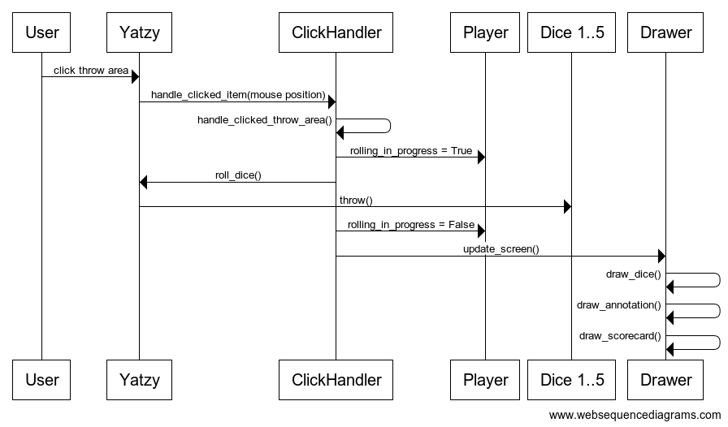
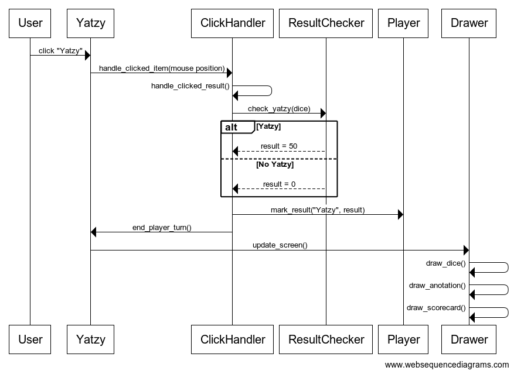

# Arkkitehtuurikuvaus

### Lopullinen luokkakaavio ja tärkeimmät muuttujat ja metodit

Yatzy-luokka yhdistää kaikki muut luokat. Yatzy sisältää oliomuuttujina listan pelaajista ja listan nopista, joita tarvitaan melkein kaikkeen toimintaan. Kun jossain pelialueelle klikataan, Yatzy kutsuu ClickHandleria joka selvittää missä on klikattu ja tekee tarvittavat toimenpiteet.

### Sovelluslogiikka
Sovelluslogiikasta huolehtivat yhteistyössä luokat Yatzy, ClickHandler, ja ResultChecker. Yatzy-luokka havainnoi käyttäjän toimintoja ja kutsuu ClickHandleria joka tarvittaessa kutsuu ResultCheckeriä.
#### Heittoalueen klikkaaminen

#### Tuloksen klikkaaminen

### Tietojen pysyväistallennus
Loppuun asti pelatut pelit tallennetaan DatabaseWriter-luokan toimesta tietokantaan. DatabaseReader puolestaan hakee menneitä pelejä tietokannasta ja käyttää samaa Drawer-luokkaa kuin itse pelikin niiden näyttämiseen.

#### Tietokantataulujen skeemat  

    CREATE TABLE tulokset(id INTEGER PRIMARY KEY,
           ykköset INTEGER, kakkoset INTEGER, kolmoset INTEGER, neloset INTEGER,
           viitoset INTEGER, kuutoset INTEGER, pari INTEGER, kaksi_paria INTEGER,
           kolme_samaa INTEGER, neljä_samaa INTEGER, pikku_suora INTEGER,
           iso_suora INTEGER, täyskäsi INTEGER, sattuma INTEGER, yatzy INTEGER, pelaaja TEXT);

*tulokset*-taulu tallentaa yksittäisiä tuloksia, ts. Yatzy-tuloslistan sarakkeita.

    CREATE TABLE pelit(id INTEGER PRIMARY KEY,
           tulos1_id INTEGER DEFAULT 0 REFERENCES tulokset,
           tulos2_id INTEGER DEFAULT 0 REFERENCES tulokset,
           tulos3_id INTEGER DEFAULT 0 REFERENCES tulokset,
           tulos4_id INTEGER DEFAULT 0 REFERENCES tulokset,
           date DATE);

*pelit*-taulu tallentaa kokonaisia pelejä, jokainen sarake haetaan viittaamalla tauluun *tulokset*. Aikaleimaa käytetään menneitä tuloksia näytettäessä.

    CREATE TABLE totals(id INTEGER PRIMARY KEY,
           tulos_id INTEGER REFERENCES tulokset, tulos INTEGER);

*totals*-taulu tallentaa yksittäisten tulosten lopulliset pistemäärät. Tätä käytetään korkeimman saavutetun tuloksen etsimisen helpottamiseksi.
