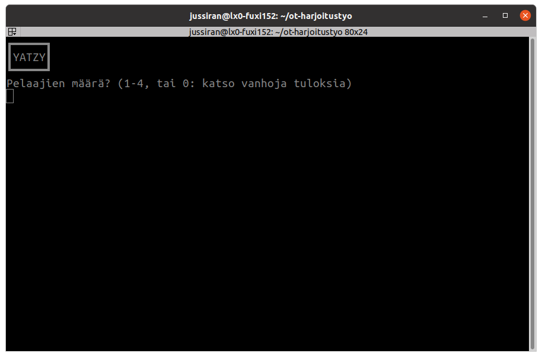
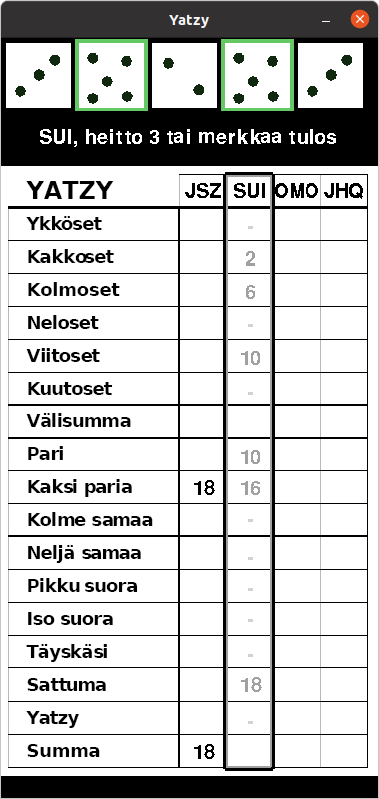
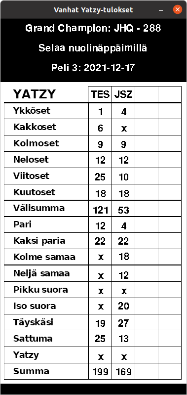

# Käyttöohje
### Alkutoimenpiteet
Käynnistyksen jälkeen syötä komentorivillä haluttu pelaajien määrä, tai 0 jos haluat nähdä menneiden pelien tuloksia.

  

Jos valitsit pelaajien määrän, syötä kaikille pelaajille nimi. Nimessä saa olla korkeintaan kolme merkkiä ja kahdella pelaajalla ei voi olla sama nimi, kirjainkoosta riippumatta.

### Peli
  

Peliä pelataan 15 kierrosta (eli kunnes tuloslista on täynnä) joissa jokainen pelaaja tekee vuorollaan seuraavat asiat:

 - Ensin pitää pyörittää noppia kerran. Se tehdään klikkaamalla noppien ja tuloslistan välissä olevaa tilaa

   - tässä vaiheessa tuloslistassa näkyy harmaalla kuinka paljon pisteitä eri ruuduissa olisi tarjolla. Vaihtoehdot jotka eivät tuottaisi pisteitä on merkattu pienellä viivalla; näihin on myös sallittua (ja useimmissa peleissä ennen pitkää pakko) sijoittaa  

 - Sen jälkeen voi kaksi kertaa:

   - valita noppia klikkaamalla mitkä haluaa pitää sellaisenaan. Tätä ilmaisee nopan ympärille ilmestyvä vihreä reuna
   - klikata samassa paikassa kuin ennenkin merkkaamattomien noppien pyörittämiseksi
   - kolmannen heiton jälkeen kaikki nopat ympyröidään sinisellä reunalla sen merkiksi että niitä ei voi enää muuttaa ja tulos on pakko sijoittaa

 - Sitten pitää merkata tulos jollekin riville tuloslistassa (tämän voi halutessaan tehdä jo ensimmäisen tai toisen heiton jälkeen, tämä myös kerrotaan pelaajille ensimmäisellä kierroksella), ei kuitenkaan riveille "Välisumma" tai "Summa", nämä lasketaan muiden perusteella automaattisesti.  

 Jos välisumman yläpuolella olevissa ruuduissa on 63 pistettä tai enemmän (tähän riittää kolme noppaa jokaisessa ruudussa ts. tulokset 3, 6, 9, 12, 15, 18), pelaaja saa 50 pisteen bonuksen joka lisätään välisummaan. Tarkemmat pisteytyssäännöt [täällä](https://fi.wikipedia.org/wiki/Yatzy#Pistelasku)

### Tulosnäkymä  
Vanhoja tuloksia pääsee näkemään valitsemalla '0' heti käynnistyksen jälkeen, tai pelaamalla pelin loppuun.  

  

Tulosnäkymässä voi selata tuloksia nuolinäppäimillä vasemmalle ja oikealle. Näkymässä ylimpänä on mainittu paras historiasta löytyvä tulos ja sen pelannut pelaaja.
